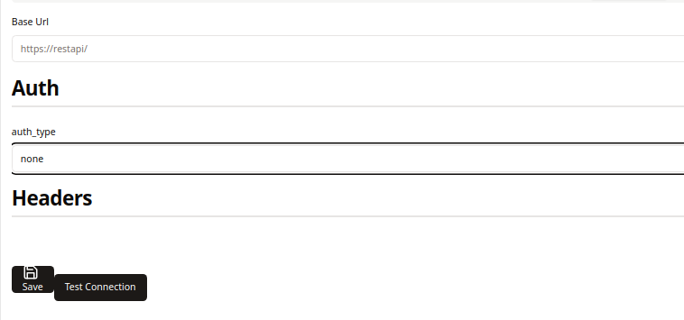
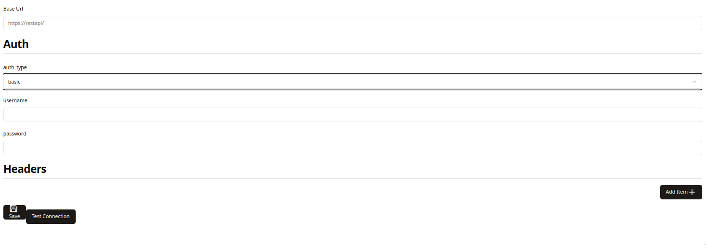
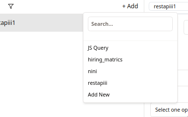

In this quick guide you're going to learn how to integrate your `REST api` into your nilefy app.
### 1. Adding the datasource 
Start by navigating to datasources and adding a new one, choose the rest api. 
From there fill in the base URL then choose the auth method, you can also add custom headers if necessary:

***
### 2. Add auth method if necessary and fill in necessary fields
Fill in the auth methods according to your RESTful api

***
### 3. Create queries to use it
Add a query using the rest api datasource you just created.
Add an endpoint if necessary

### 4. Use it (we'll use a table as an example)

drag and drop a table from the side menue.
click on it and in the data section retreive the query's results by accessing it's data property

!! voila you used your RESTful api successfully ⚡⚡