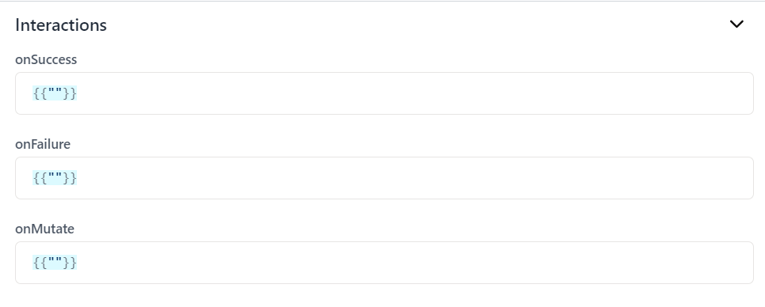

# Azure Blob Storage

This document provides guidance on how to perform various operations on a connected Azure Blob Storage data source in Nilefy. You will learn how to connect to Azure Blob Storage, perform various operations, and configure actions based on the operations's success, failure, and mutation. Additionally, how to set the trigger mode to run the operation manually or on app load.

## Step-by-Step Guide

### 1. Connecting to Azure Blob Storage Data Source

To connect your Azure Blob Storage to your workspace, follow these steps:

1. **Navigate to Data Source Configuration**:
   - Go to the data source configuration section.

    

2. **Add a New Data Source**:
   - Choose Azure Blob Storage from the list of available data sources.
   - Select the option to add a new data source.
   - Provide a name for the connection.

   

3. **Provide Connection Details**:

    

   - **Name**: You can change the connection name.
   - **Connection String**: Enter the connection string for your Azure Blob Storage account.

    The connection string has the following format:

    ```bash
    DefaultEndpointsProtocol=https;AccountName=your_account_name;AccountKey=your_account_key;EndpointSuffix=core.windows.net
    ```

4. **Test the Connection**:
   - Ensure that the connection details are correct and that you can successfully connect to the Azure Blob Storage data source.

5. **Save the Connection**:
   - Save the connection configuration. This connection will now be available for use in your queries.


### 2. Running a Query

Once your Azure Blob Storage is connected, you can perform various operations as follows:

1. **Navigate to the Query Section**:
   - Go to the query configuration section in your application.
    
    
  
2. **Create a New Query**:
   - Select the option to add a new query.
   - Select your connected Azure CLoud Storage data source.

    

   - Select the operation you want to perform and enter the required information.
    
    

3. **Configuring Actions**: Configure the actions to be performed based on the query's result.

    

    - **Define Success Actions**: Specify the actions to be performed when the query executes successfully, e.g., refresh a data table to display the retrieved data. 

    - **Define Failure Actions**: Specify the actions to be performed when the query fails, e.g., display an error notification or message to the user.

    - **Define Mutation Actions**: Specify the actions to be performed when data is mutated as a result of the query, e.g., reload other related data sources to ensure consistency or start secondary actions that depend on the data change.

4. **Setting the Trigger Mode**: determine how and when the query should be triggered.
    
    

    - **Manual Trigger**: The query will only run when explicitly called by the user or through specific actions, such as button clicks.

    - **App Load Trigger**: The query will run automatically when the application or specific page loads.

## Available Operations

### 1. List Containers

To list all containers with an optional flag to include deleted containers:

- **Include Deleted Containers (optional)**: Specify whether to include deleted containers in the list.

### 2. List Blobs

To list blobs in a specific container:

- **Container Name**: Specify the name of the container.
- **Page Size**: Specify the number of blobs to list per page.
- **Prefix (optional)**: Provide a prefix to filter the blobs listed.
- **Continuation Token (optional)**: Provide a continuation token for paginated results.

### 3. Create Container

To create a new container:

- **Container Name**: Specify the name of the container to be created.

### 4. Upload Blob

To upload a blob to a specific container:

- **Container Name**: Specify the name of the container.
- **Blob Name**: Specify the name of the blob.
- **Content**: Provide the content of the blob.
- **Content Type**: Specify the content type of the blob.

### 5. Delete Container

To delete a container:

- **Container Name**: Specify the name of the container.

### 6. Delete Blob

To delete a blob from a specific container:

- **Container Name**: Specify the name of the container.
- **Blob Name**: Specify the name of the blob to be deleted.

### 7. Read Blob

To read a blob from a specific container:

- **Container Name**: Specify the name of the container.
- **Blob Name**: Specify the name of the blob to be read.

By following these steps, you can effectively connect to Azure Storage and perform various operations. This allows you to manage and interact with your storage seamlessly within your applications.