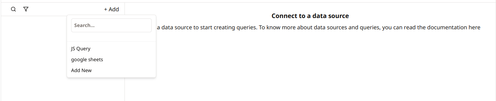

# Google Sheets

This document provides guidance on how to perform various operations on a connected Google Sheets data source in Nilefy. You will learn how to connect to Google Sheets, perform various operations, and configure actions based on the operations's success, failure, and mutation. Additionally, how to set the trigger mode to run the operation manually or on app load.

## Step-by-Step Guide

### 1. Connecting to Google Sheets Data Source

To connect your Google Sheets to your workspace, follow these steps:

1. **Navigate to Data Source Configuration**:
   - Go to the data source configuration section.

    

2. **Add a New Data Source**:
    - Choose Google Sheets from the list of available data sources.
    - Select the option to add a new data source.
    - Provide a name for the connection.
    
    

3. **Provide Connection Details**:

    

    - **Scopes**: Enter the scopes from your Google Sheets service account.

4. **Test the Connection**:
   - Ensure that the connection details are correct and that you can successfully connect to the Google Sheets data source.

5. **Save the Connection**:
    - Save the connection configuration. This connection will now be available for use in your queries.

### 2. Running a Query

Once your Google Sheets is connected, you can perform various operations as follows:

1. **Navigate to the Query Section**:
   - Go to the query configuration section in your application.

    

2. **Create a New Query**:
   - Select the option to add a new query.
   - Select your connected Google CLoud Storage data source.

    

   - Select the operation you want to perform and enter the required information.
    
    

3. **Configuring Actions**: Configure the actions to be performed based on the query's result.

    

    - **Define Success Actions**: Specify the actions to be performed when the query executes successfully, e.g., refresh a data table to display the retrieved data. 

    - **Define Failure Actions**: Specify the actions to be performed when the query fails, e.g., display an error notification or message to the user.

    - **Define Mutation Actions**: Specify the actions to be performed when data is mutated as a result of the query, e.g., reload other related data sources to ensure consistency or start secondary actions that depend on the data change.

4. **Setting the Trigger Mode**: determine how and when the query should be triggered.
    
    

    - **Manual Trigger**: The query will only run when explicitly called by the user or through specific actions, such as button clicks.

    - **App Load Trigger**: The query will run automatically when the application or specific page loads.

## Available Operations

### 1. Get Spreadsheet Information

To retrieve information about a specific Google Sheets spreadsheet:

- **Operation**: `info`
- **Spreadsheet ID**: Specify the ID of the spreadsheet.

### 2. Read Data from Spreadsheet

To read data from a specific range within a Google Sheets spreadsheet:

- **Operation**: `read`
- **Spreadsheet ID**: Specify the ID of the spreadsheet.
- **Spreadsheet Range**: Specify the range to read data from (e.g., `Sheet1!A1:D10`).
- **Sheet Name**: Specify the name of the sheet.

### 3. Append Data to Spreadsheet

To append rows of data to a specific sheet in a Google Sheets spreadsheet:

- **Operation**: `append`
- **Spreadsheet ID**: Specify the ID of the spreadsheet.
- **Sheet Name**: Specify the name of the sheet.
- **Rows**: Provide the rows of data to append as an array.

### 4. Update Data in Spreadsheet

To update data in a specific range within a Google Sheets spreadsheet based on a condition:

- **Operation**: `update`
- **Spreadsheet ID**: Specify the ID of the spreadsheet.
- **Spreadsheet Range**: Specify the range to update data in (e.g., `Sheet1!A1:D10`).
- **Sheet Name**: Specify the name of the sheet.
- **Where Field**: Specify the field (column) to apply the condition.
- **Where Operation**: Specify the operation for the condition (e.g., `equals`, `contains`).
- **Where Value**: Specify the value to match in the condition.
- **Body**: Provide the new data to update as a JSON string.

### 5. Delete Row from Spreadsheet

To delete a specific row from a sheet in a Google Sheets spreadsheet:

- **Operation**: `delete_row`
- **Spreadsheet ID**: Specify the ID of the spreadsheet.
- **Sheet Name**: Specify the name of the sheet.
- **Row Index**: Specify the index of the row to be deleted (0-based index).

By following these steps, you can effectively interact with Google Sheets and perform various operations to manage and manipulate your spreadsheet data. This allows you to seamlessly integrate Google Sheets functionality within your applications.
