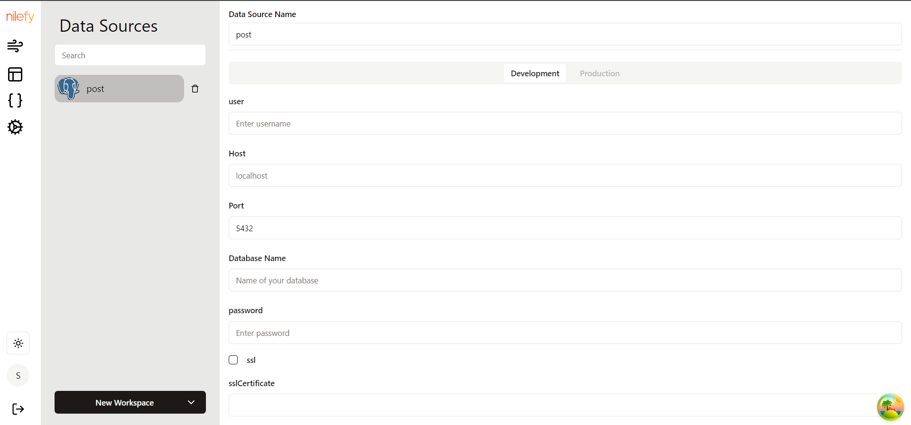

# Overview of Data Sources in *Nilefy*

One of the crucial aspects of Nilefy is its ability to connect with various data sources, enabling users to integrate, manipulate, and display data seamlessly within their applications. This document provides an overview of the data sources available in Nilefy and guides users on how to connect and utilize these data sources in their applications.

## Types of Data Sources

### 1. Databases
- **Relational Databases**: Nilefy supports SQL databases like PostgreSQL. Users can connect to the database to fetch and manipulate structured data using SQL queries.
- **NoSQL Databases**: For unstructured data, Nilefy supports NoSQL databases such as MongoDB.

### 2. APIs
- **REST APIs**: Nilefy allows users to connect to external RESTful services using API endpoints. This enables integration with third-party services, cloud platforms, and microservices.

### 3. Cloud Services
- **Cloud Storage**: Integration with cloud storage services like Google Cloud Storage, and Azure Blob Storage allows users to manage and utilize large volumes of data.

### 4. Spreadsheets
- **Google Sheets**: Nilefy supports real-time integration with Google Sheets, enabling dynamic data fetching and updating.

## Connecting Data Sources

To connect a data source to your application, follow these general steps:

1. **Select the Data Source Type**:
   - Navigate to the data source configuration section.
   - Choose the data source you want to connect.

   

2. **Provide Connection Details**:
   - For databases, enter the necessary connection parameters such as host, port, database name, username, and password.
   - For APIs, specify the endpoint URL, authentication method, and any required headers.
   - For cloud services, provide the necessary credentials and configuration details specific to the service.

    

4. **Test the Connection**:
   - Ensure the connection is successful and data can be retrieved without issues.

## Running Queries

Once your data source is connected, you can perform various operations as follows:

1. **Configure Data Access**:
   - Set up queries on your application to fetch specific data as needed.

   

2. **Perform Actions on Queries**:
   - Perform actions such as running and resetting these queries.

   1. **Run the Query**
   To run the query within your application:
      - **Manual Execution**: Provide a trigger in your application UI that the user can use to run the query using `query.run()` action.
      - **Automatic Execution**: Configure the query to run automatically on the application loads. 

   2. **Reset the Query**
   If your application needs to reset the query (e.g., clear the data and error properties of the query), provide a reset action using `query.reset()`.

3. **Handle Query Results**: 
   - Configure the actions to be performed based on the query's result.

   

   1. **Define Success Actions**: Specify the actions to be performed when the query executes successfully, e.g., refresh a data table to display the retrieved data. 

   2. **Define Failure Actions**: Specify the actions to be performed when the query fails, e.g., display an error notification or message to the user.

   3. **Define Mutation Actions**: Specify the actions to be performed when data is mutated as a result of the query, e.g., reload other related data sources to ensure consistency or start secondary actions that depend on the data change.

By leveraging the data source capabilities of Nilefy, you can create robust, data-driven applications that streamline business processes and deliver valuable insights.