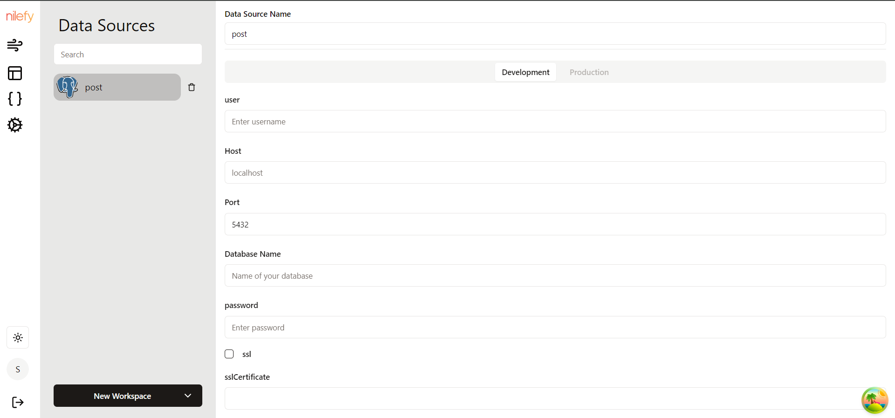
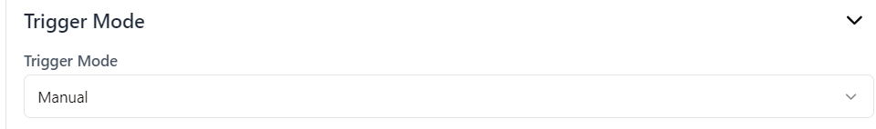

# PostgreSQL 

Nilefy provides powerful tools to run queries on connected databases, including PostgreSQL. This document will guide you through the process of connecting to a PostgreSQL data source, running a query, saving the query, and configuring actions based on the query's success, failure, and mutation. Additionally, how to set the trigger mode to run the query manually or on app load.

## Step-by-Step Guide

### 1. Connecting to PostgreSQL Database

To connect your PostgreSQL database to your workspace, follow these steps:

1. **Navigate to Data Source Configuration**:
   - Go to the data source configuration section.

    

2. **Add a New Data Source**:
   - Choose PostgreSQL from the list of available data sources.
   - Select the option to add a new data source.
   - Provide a name for the connection.

   

3. **Provide Connection Details**:

     

   - **Name**: You can change the connection name.
   - **User**: Enter the username for accessing the database.
   - **Host**: Enter the host address of your PostgreSQL server, e.g., `localhost` or `db.example.com`.
   - **Port**: Enter the port number, typically `5432`.
   - **Database Name**: Enter the name of the database you want to connect to.
   - **Password**: Enter the password associated with the username.
   - **SSL**: Choose whether to use SSL (Secure Sockets Layer) for the connection to enhance the security.
   - **SSL Certificate**: If SSL is enabled, provide the SSL certificate details as required by your PostgreSQL setup.
   - **Connection Options**: Add any additional connection options, such as timeout settings or specific client encoding.

4. **Test the Connection**:
   - Ensure that the connection details are correct and that you can successfully connect to the PostgreSQL database.

5. **Save the Connection**:
   - Save the connection configuration. This connection will now be available for use in your queries.

### 2. Running a Query

Once your PostgreSQL database is connected, you can proceed to run queries:

1. **Navigate to the Query Section**:
   - Go to the query configuration section in your application.
    
    
   

2. **Create a New Query**:
   - Select the option to add a new query.
   - Select your connected PostgreSQL database.

    

   - Enter your SQL query and other configurations in the query editor.
    
    

3. **Configuring Actions**: Configure the actions to be performed based on the query's result.

    

    - **Define Success Actions**: Specify the actions to be performed when the query executes successfully, e.g., refresh a data table to display the retrieved data. 

    - **Define Failure Actions**: Specify the actions to be performed when the query fails, e.g., display an error notification or message to the user.

    - **Define Mutation Actions**: Specify the actions to be performed when data is mutated as a result of the query, e.g., reload other related data sources to ensure consistency or start secondary actions that depend on the data change.

4. **Setting the Trigger Mode**: determine how and when the query should be triggered.
    
    

    - **Manual Trigger**: The query will only run when explicitly called by the user or through specific actions, such as button clicks.

    - **App Load Trigger**: The query will run automatically when the application or specific page loads.

By following these steps, you can effectively connect to a PostgreSQL database, run queries, handle different outcomes, and control when the queries are executed in your application.