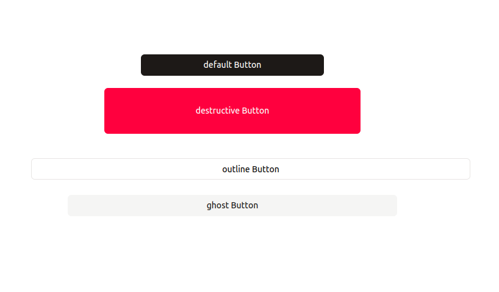

# Button

Button widget that allows you to perform various tasks, like running data queries, JS queries, and other actions.



## General Properties

List of properties that can be updated through the inspector panel to customize the widget to your preferences and project needs.

You can type code nearly anywhere in Nilefy, and the following properties are no exception.

### Text

Sets the text that appears inside the button widget.

- Accept `string`

### Tool tip

Sets a tooltip that appears when the user hovers over the widget. It enables you to add hints or provide additional information for the button.

- Accepts `string | undefined`

### isLoading

Controls if the button should be disabled and show a loading state.

- Accepts `boolean`

### isDiabled

Controls if the button should be disabled.

- Accepts `boolean`

## Events

Events users can react to with custom logic.

### onClick

Gets triggered when the button is clicked.

example 

```ts
{{WebloomGlobals.alert("hi")}}
```

## Setters - Methods

A list of methods that can be called on the button widget instance to control the widget programmatically.

### setText

Sets the text shown on the button.

- interface: `(value: string) => void`

### setDisabled 

Sets the button's disabled state.

- interface: `(disabled: boolean) => void`

### setIsLoading 

Sets the button's loading state.

- interface: `(loading: boolean) => void`
