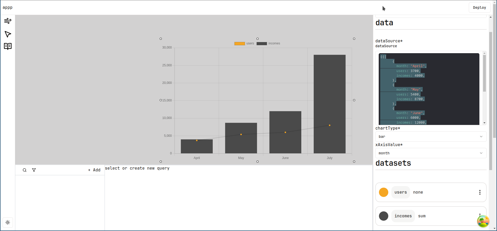

# Chart

chart component can be used to Visualize data from any source like dataSource(through using js template `{{}}`) or hardcoded array of data, the chart component is built using [chart.js](https://www.chartjs.org/docs/latest/).



## Supported data structures

the chart component needs the data to be array of objects, for example

```ts
[
      {
        month: "April",
        users: 3700,
        incomes: 4000,
      },
      {
        month: "May",
        users: 5400,
        incomes: 8700,
      },
      {
        month: "June",
        users: 6000,
        incomes: 12000,
      },
      {
        month: "July",
        users: 8000,
        incomes: 14000,
      },
]
```

## Aggregation Methods

**Aggregation**: Summarize the values for a group.


| Function      | Description                                       |
| ------------- | ------------------------------------------------- |
| count         | Returns the quantity of items for each group.    |
| sum           | Returns the summation of all numeric values.      |
| avg           | Returns the average of all numeric values.        |
| median        | Returns the median of all numeric values.         |
| mode          | Returns the mode of all numeric values.           |
| rms           | Returns the rms of all numeric values.            |
| stddev        | Returns the standard deviation of all numeric values. |
| min           | Returns the minimum numeric value for each group. |
| max           | Returns the maximum numeric value for each group. |
| first         | Returns the first numeric value for each group.   |
| last          | Returns the last numeric value for each group.    |


## Chart types

support the following chart types

- Bar chart: for more information check [chart.js docs](https://www.chartjs.org/docs/latest/charts/bar.html)

- Line chart: for more information check [chart.js docs](https://www.chartjs.org/docs/latest/charts/line.html)

- Scatter chart: for more information check [chart.js docs](https://www.chartjs.org/docs/latest/charts/scatter.html)

## General 

### xAxisValue

select which key from the object will be used in the x-axis

### tooltip

text to be shown when user hover over chart

### legendPosition

for more information check [chart.js](https://www.chartjs.org/docs/latest/configuration/legend.html#position)

define where the legend will be shown, can be one of the following

| Option  | Description                            |
| ------- | -------------------------------------- |
| top     | Position at the top                    |
| left    | Position at the left                   |
| bottom  | Position at the bottom                 |
| right   | Position at the right                  |
| none    | Disable the legend (no legend displayed)|

## title

set chart title

## xAxisName

The title to display for the X-axis.

## yAxisName
The title to display for the Y-axis.

