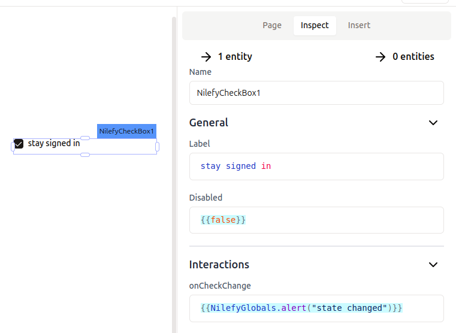

# CheckBox

A checkbox to toggle a boolean value.



## General Properties

List of properties that can be updated through the inspector panel to customize the widget to your preferences and project needs.

You can type code nearly anywhere in Nilefy, and the following properties are no exception.

### Label

Sets the label of the checkbox.

- Accept `string`

### Disabled

Controls if the checkbox should be disabled.

- Accepts `boolean`

## Events

Events users can react to with custom logic.

### onCheckChange

Gets triggered when the checkbox state changes, either from true to false or vice versa.

example 

```ts
{{NilefyGlobals.alert("checkbox state changed")}}
```

## Instance Properties

These are properties that can be accessed using the dot operator from any widget instance, in any place you can type code, such as other widget properties or in JS queries.

### value `boolean`

holds the checkbox value

## Setters - Methods

A list of methods that can be called on the button widget instance to control the widget programmatically.

### setDisabled 

Sets the checkbox's disabled state.

- interface: `(disabled: boolean) => void`
