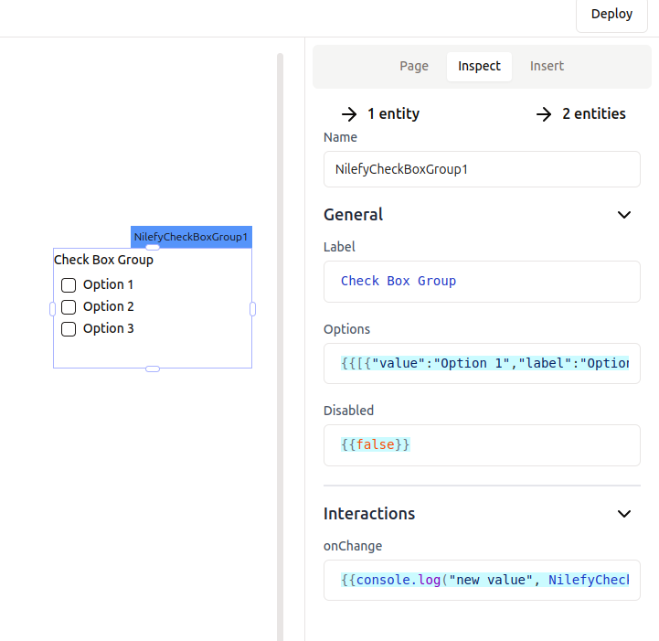

# CheckBox Group

A checkbox to select multiple items from list of predefined elements



## General Properties

List of properties that can be updated through the inspector panel to customize the widget to your preferences and project needs.

You can type code nearly anywhere in Nilefy, and the following properties are no exception.

### Label

Sets the label of the checkbox.

- Accept `string`

### Options

control checkbox group widget options

- Accepts `{label: sring; value: string}[]`

- options example 

```ts
{{
    [
        {"value":"Option 1","label":"Option 1"},
        {"value":"Option 2","label":"Option 2"},
        {"value":"Option 3","label":"Option 3"}
    ]
}}
```

- example of options from JS query

```ts
{{jsQuery1.data.map(v => ({value: v.value.toString(), label: v.value.toString()}))}}
```

### Disabled

Controls if the checkbox should be disabled.

- Accepts `boolean`

## Events

Events users can react to with custom logic.

### onChange

Gets triggered when the checkbox selection state changes.

example of code you could run in react to change

```ts
{{NilefyGlobals.alert("checkbox state changed")}}
```

## Instance Properties

These are properties that can be accessed using the dot operator from any widget instance, in any place you can type code, such as other widget properties or in JS queries.

### value `array<{label: string; value: string}>`

holds the checkbox group selection state

## Setters - Methods

A list of methods that can be called on the button widget instance to control the widget programmatically.

### setDisabled 

Sets the checkbox's disabled state.

- interface: `(disabled: boolean) => void`

### setOptions

set the checkbox group options programmatically

- interface: `(options: array<{value: string; label: string;}>) => void`

### setValue

set the checkbox group value programmatically

- interface: `(value: array<{value: string; label: string;}>) => void`
