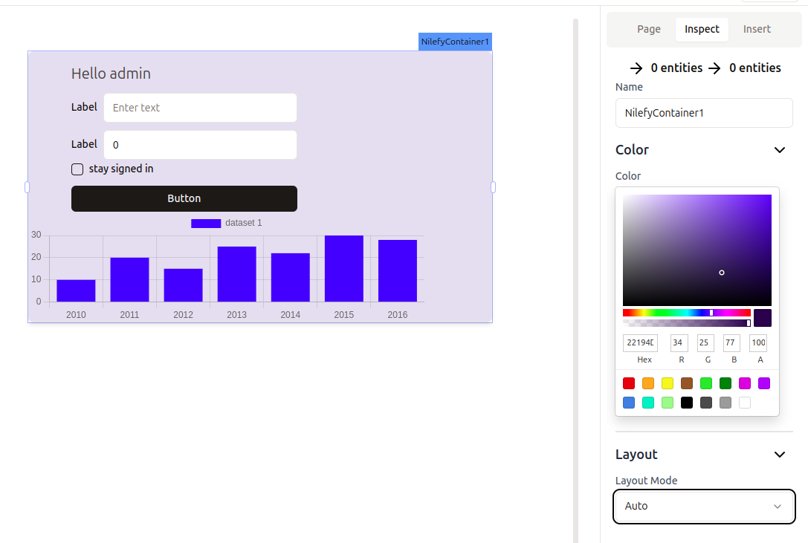

# Container

Container widget used to group widgets together and create layout for your application.

## General Properties

List of properties that can be updated through the inspector panel to customize the widget to your preferences and project needs.

You can type code nearly anywhere in Nilefy, and the following properties are no exception.

### Color 

Sets the container background color

- Accept `string`

### Layout mode

sets the layout mode for the container 

- **fixed** means while developing the application the height of the container won't expand when you add new widgets inside the container, but the container will be scrollable

- **auto** the height of the container will adapt to the sum of all widgets inside the container(container won't should scrollbar)

- Accepts `auto | fixed`
