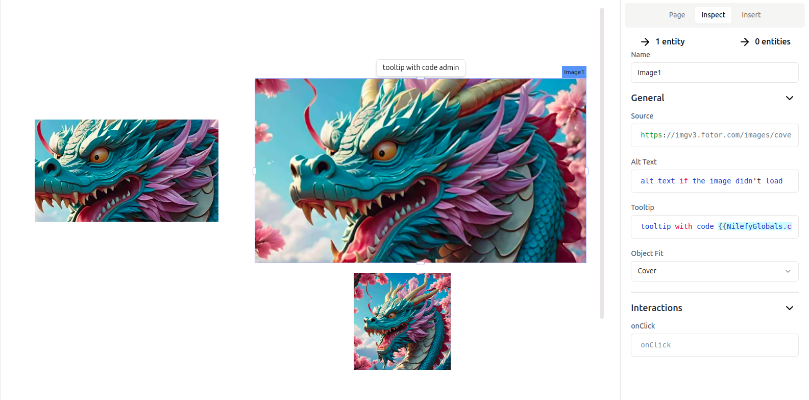

# Image

Image widget to add images to your application using urls, The Image widget supports popular formats such as JPG, PNG, SVG, WebP, and GIF.



## General Properties

List of properties that can be updated through the inspector panel to customize the widget to your preferences and project needs.

You can type code nearly anywhere in Nilefy, and the following properties are no exception.

### Source

Sets the image url

- Accept `string`

### Alt Text

The `alt` attribute holds a textual replacement for the image

- Accept `string | undefined`

for more information about alt text cehck [MDN](https://developer.mozilla.org/en-US/docs/Web/API/HTMLImageElement/alt#usage_notes)

### Tool tip

Sets a tooltip that appears when the user hovers over the widget. It enables you to add hints or provide additional information for the widget.

- Accepts `string | undefined`

### Object fit 

Sets how the image should be resized to fit its container.

for more information about css object fit check [https://developer.mozilla.org/en-US/docs/Web/CSS/object-fit](https://developer.mozilla.org/en-US/docs/Web/CSS/object-fit)

- Accepts:  `'fill' | 'none' | 'contain' | 'cover' | 'scale-down'`
- Default `contain`

## Events

Events users can react to with custom logic.

### onClick

Gets triggered when the image is clicked.

example 

```ts
{{WebloomGlobals.alert("hi")}}
```

## Instance Properties

These are properties that can be accessed using the dot operator from any widget instance, in any place you can type code, such as other widget properties or in JS queries.

### src 

use to access image current url

for example `{{Image1.src}}`

## Setters - Methods

A list of methods that can be called on the button widget instance to control the widget programmatically.

### setSrc

Sets the image src

- interface: `(src: string) => void`
