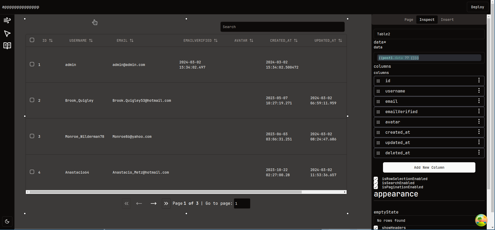

# Table

Table component! our table component is built with [TanStack Table](https://tanstack.com/table/latest)

## Events

### onRowSelectionChange: 

run when row selection changes(select or deselect), it exactly will run when tanstack table trigger this event [onRowSelectionChange](https://tanstack.com/table/v8/docs/api/features/row-selection#onrowselectionchange)

### onPageChange: 

run if the Pagination is enabled and the page changes, it exactly will run when tanstack table trigger this event [onPaginationChange](https://tanstack.com/table/v8/docs/api/features/pagination#onpaginationchange)

### onSearchChange: 

run if the global search is enabled

### onSortChange: 

run when any column sorting changes, it exactly will run when tanstack table trigger this event [onSortingChange](https://tanstack.com/table/v8/docs/api/features/sorting#onsortingchange)

## Setters

### `setData`

`setData(array<object>): void`

sets the table data, note this data only for runtime won't be stored on the server
