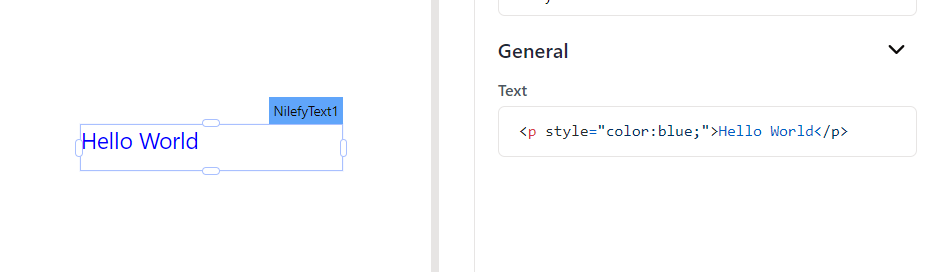
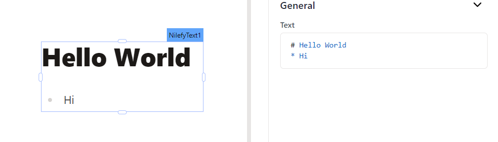

# General

**Text string** 

Sets the text to be displayed. The text remains unchanged until manually updated or edited.

You can dynamically change text by fetching data from queries or JS functions and binding the response to the Text property. For instance, when a row in a Table widget is clicked, the Text widget dynamically displays the specific name associated with that row.

Example:

`{{Table1.selectedRow.name}}`

You have the option to use HTML code within the Text property to customize the appearance of the displayed text. Note that the Text field supports only inline CSS.

Example:

Hello World

This code displays the text Hello World in blue color.

Moreover You have the option to use Mark Down within the Text property to customize the appearance of the displayed text.

Example:

`# Hello World `

`* Hi`

This code displays the text as follows.

