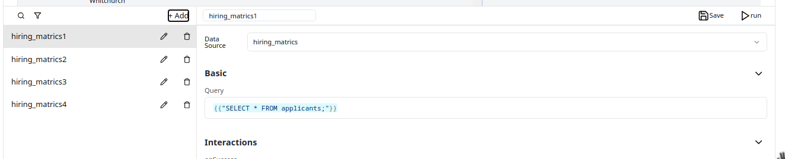
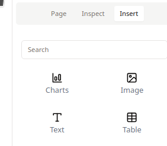
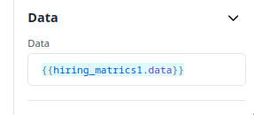
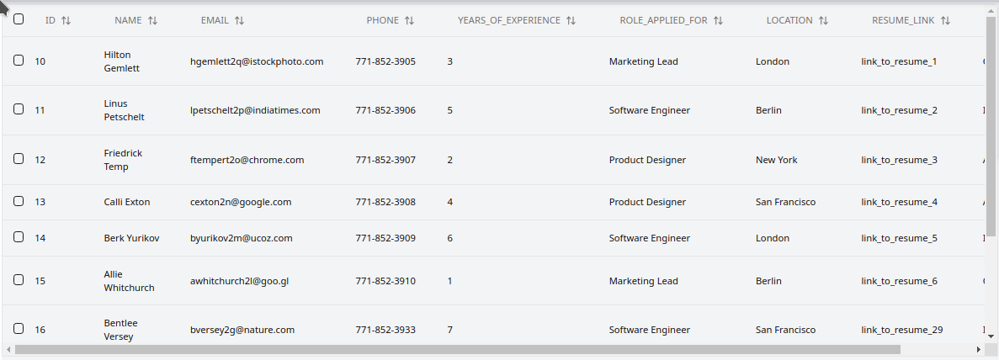

<!-- # Use-case: Hiring Metrics dashboard -->
In This example, I'll walk you through the steps to create a hiring metrics dashboard example using Nilefy. 

Before we start, what we are about to build is basically a tool to empower your HR teams, hiring managers, and senior leaders with an advanced hiring metrics dashboard that offers real-time insights into the recruitment process. Featuring a user-friendly interface to evaluate key metrics and automated tools for candidate communication, this dashboard streamlines your hiring workflow and accelerates the time-to-hire, making your recruitment efforts more efficient and effective.

### Let's start by building the database we're going to use
For this example I'm going to use postgres db and do the following: 
Step 1: Create the Database Schema
1. Create Tables: You'll need tables for applicants, applications, and possibly other related tables.
2. Define Columns: you'll need columns for name, email, phone number, years of experience, role applied for, location, resume link, status, etc.

### Step 1: Here is a basic SQL schema that you can use:

``` sql
CREATE TABLE applicants (
    id SERIAL PRIMARY KEY,
    name VARCHAR(255) NOT NULL,
    email VARCHAR(255) NOT NULL UNIQUE,
    phone VARCHAR(20),
    years_of_experience INT,
    role_applied_for VARCHAR(255),
    location VARCHAR(255),
    resume_link VARCHAR(255),
    status VARCHAR(50)
);

CREATE TABLE applications (
    id SERIAL PRIMARY KEY,
    applicant_id INT REFERENCES applicants(id),
    job_role VARCHAR(255),
    applied_at TIMESTAMP DEFAULT CURRENT_TIMESTAMP
);
```
### Step 2: Insert Sample Data
Insert some sample data to mimic the records
```sql
INSERT INTO applicants (name, email, phone, years_of_experience, role_applied_for, location, resume_link, status)
VALUES 
    ('Hilton Gemlett', 'hgemlett2q@istockphoto.com', '771-852-3905', 3, 'Marketing Lead', 'London', 'link_to_resume_1', 'Contacted'),
    ('Linus Petschelt', 'lpetschelt2p@indiatimes.com', '771-852-3906', 5, 'Software Engineer', 'Berlin', 'link_to_resume_2', 'Interviewed'),
    ('Friedrick Temp', 'ftempert2o@chrome.com', '771-852-3907', 2, 'Product Designer', 'New York', 'link_to_resume_3', 'Applied'),
    ('Calli Exton', 'cexton2n@google.com', '771-852-3908', 4, 'Product Designer', 'San Francisco', 'link_to_resume_4', 'Applied'),
    ('Berk Yurikov', 'byurikov2m@ucoz.com', '771-852-3909', 6, 'Software Engineer', 'London', 'link_to_resume_5', 'Interviewed'),
    ('Allie Whitchurch', 'awhitchurch2l@goo.gl', '771-852-3910', 1, 'Marketing Lead', 'Berlin', 'link_to_resume_6', 'Contacted'),
    ('Bentlee Versey', 'bversey2g@nature.com', '771-852-3933', 7, 'Software Engineer', 'San Francisco', 'link_to_resume_29', 'Interviewed'),
    ('Evan Lipsett', 'elipsett2f@cf2.com', '771-852-3934', 8, 'Product Designer', 'New York', 'link_to_resume_30', 'Applied'),
    ('Hilton Gemlett', 'hgemlett2q@istockphoto.com', '771-852-3935', 3, 'Marketing Lead', 'London', 'link_to_resume_31', 'Contacted'),
    ('Linus Petschelt', 'lpetschelt2p@indiatimes.com', '771-852-3936', 5, 'Software Engineer', 'Berlin', 'link_to_resume_32', 'Interviewed'),
    ('Friedrick Temp', 'ftempert2o@chrome.com', '771-852-3937', 2, 'Product Designer', 'New York', 'link_to_resume_33', 'Applied'),
    ('Calli Exton', 'cexton2n@google.com', '771-852-3938', 4, 'Product Designer', 'San Francisco', 'link_to_resume_34', 'Applied'),
    ('Berk Yurikov', 'byurikov2m@ucoz.com', '771-852-3939', 6, 'Software Engineer', 'London', 'link_to_resume_35', 'Interviewed'),
    ('Allie Whitchurch', 'awhitchurch2l@goo.gl', '771-852-3940', 1, 'Marketing Lead', 'Berlin', 'link_to_resume_36', 'Contacted'),
    ('Donall Quatrucci', 'dquatrucci2k@photobucket.com', '771-852-3941', 7, 'Product Designer', 'San Francisco', 'link_to_resume_37', 'Interviewed'),
    ('Patrick Bulbrook', 'pbulbrook2j@livejournal.com', '771-852-3942', 2, 'Software Engineer', 'New York', 'link_to_resume_38', 'Applied') ON CONFLICT DO NOTHING;

INSERT INTO applications (applicant_id, job_role)
VALUES 
    (1, 'Product Designer'),
    (2, 'Product Designer'),
    (3, 'Product Designer'),
    (4, 'Product Designer') ON CONFLICT DO NOTHING;
```

### Step 3: Add (hiring_metrics)queries to count respective data
The way you do it is simple, you simply create a new query in our app paste the respective needed sql query. _make sure to include it as a string inside 2 nested curly braces like so : {{"SELECT * FROM applicants"}}_


Here are a few sql queries that we're going to use:

1. Count Total Applications:
```sql
SELECT COUNT(*) AS total_applicants
FROM applicants;
```
1. Count Total Interviewed
```sql
SELECT COUNT(*) AS total_interviewed
FROM applicants
WHERE status = 'Interviewed';
```
1. Count Total Contacted
```sql
SELECT COUNT(*) AS total_contacted
FROM applicants
WHERE status = 'Contacted';
```

### Step 4: Create the table and view your data
Create a table by dragging and dropping it from the side menue


To view the our records in the table first we need to create a query that would get all the applicants as seen in the picture:


to automatically generate the table headers and view the data inside our table, we need to pass the data generated by the query to the data field of the table properties:


Here is what the table should look like now⚡:


_notice I checked `RowSelection` from `table options` to make it selectible_
