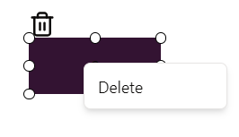

# Delete Action is used to delete a compomnenet.

* you can delete any element by clicking on it and a trash can will appear on top of it or you can right click it and a delete option will appear.

* it can be unDone using ctrl + Z