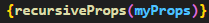
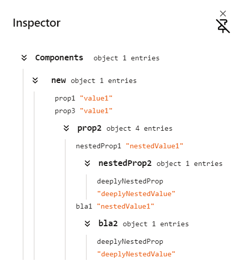
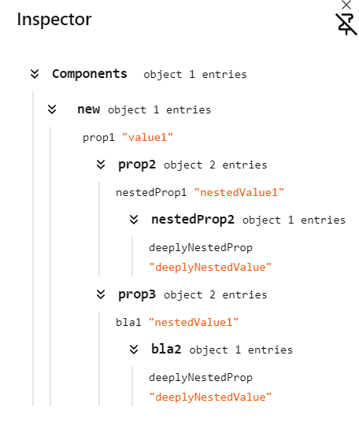
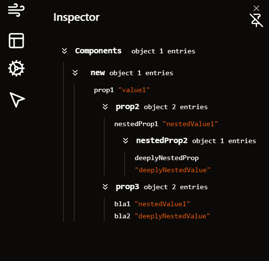

* recursiveprops function returns elements props can be used like this

* it only takes the element props and returns the props in collapsiable shadcn component

* When you click at ant element in the inspector it will be highlighted in the Editor

<video src="inspector.mp4" controls title="Title"></video>
# Pics from the Insperctor and the Viewer

